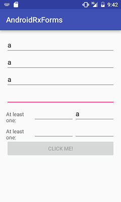

# AndroidRxForms
Some experiments with Rx on Android

* toggle button state on EditText field input changes

```
eachOf(
    notEmpty(editText),
    notEmpty(editText1),
    notEmpty(editText2),
    notEmpty(editText3),
    atLeastOneOf(
            notEmpty(editText4),
            notEmpty(editText5)),
    atLeastOneOf(
            notEmpty(editText6),
            notEmpty(editText7)))
.subscribe(button::setEnabled);
```

